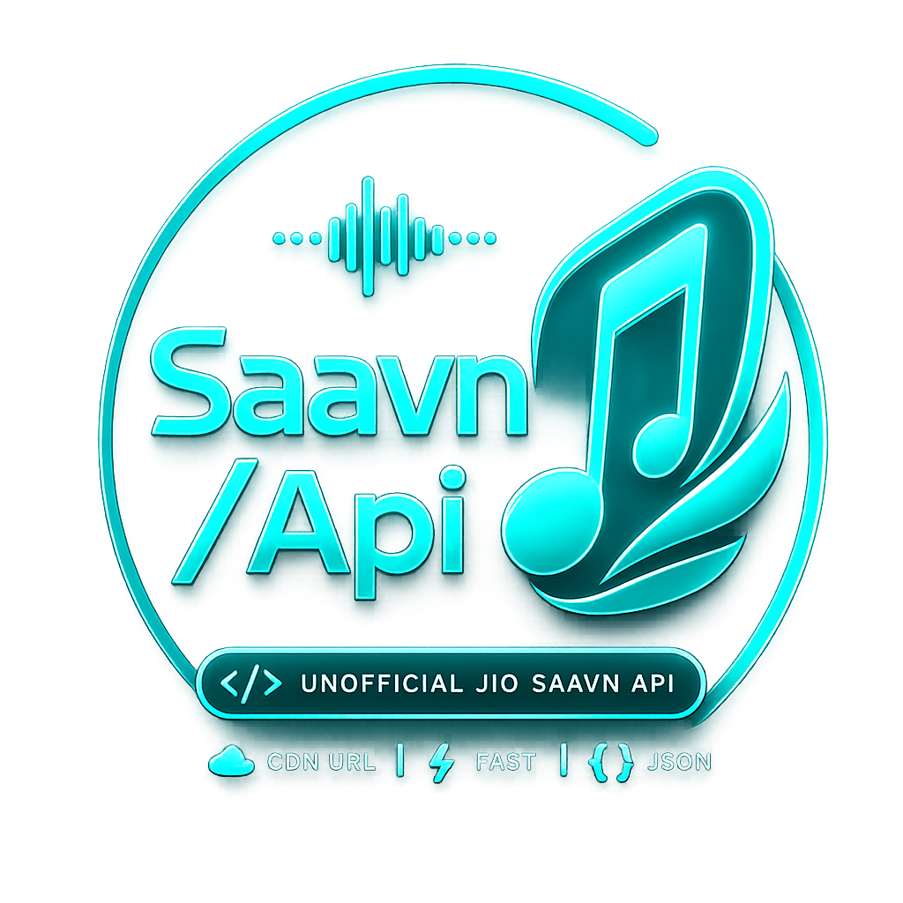

<div align="center">



# saavn/api

**Unofficial JioSaavn REST API — Node.js + Express backend, Vite + React frontend, bundled for Vercel serverless.**

<p>
  
  
  
  
  
  
</p>

<b>14 endpoints</b> · <b>DES-decrypted media URLs</b> · <b>edge-cached</b> · <b>CORS-open</b> · <b>zero keys</b>

<p>
  <a href="#-quick-start">Quick start</a> ·
  <a href="#-deploy-to-vercel">Deploy</a> ·
  <a href="#-api-reference">API reference</a> ·
  <a href="#-credits">Credits</a>
</p>

</div>

---

## 📖 Table of contents

- [Highlights](#-highlights)
- [Quick start](#-quick-start)
- [Deploy to Vercel](#-deploy-to-vercel)
- [API reference](#-api-reference)
- [Response format](#-response-format)
- [Caching strategy](#-caching-strategy)
- [Examples](#-examples)
- [Project structure](#-project-structure)
- [Creators](#-creators)
- [Credits](#-credits)
- [Disclaimer](#-disclaimer)

---

## ✨ Highlights

- 🎧 **Full JioSaavn coverage** — search, songs, albums, artists, playlists, suggestions
- 🔓 **Direct download URLs** — server-side DES decryption, streamable CDN links
- ⚡ **Edge-cached** — `s-maxage` + `stale-while-revalidate` on every response
- 🇮🇳 **Region-pinned** — deployed to Mumbai (`bom1`) for the full Indian catalogue
- 📦 **Single-bundle function** — the whole API is bundled into one Vercel serverless function via a custom esbuild pipeline
- 🌗 **Light / dark UI** — persisted, no flash on load
- 🧠 **Interactive explorer** — try every endpoint from the landing page
- 🏷️ **Built-in attribution** — every JSON response carries a `credits` object (see [Response format](#-response-format))

---

## 🚀 Quick start

**Requirements:** Node.js 20.x

```bash
npm install
npm run dev          # frontend :5173, api :3001
```

| Script | What it does |
| --- | --- |
| `npm run dev` | Runs the API (`:3001`) and Vite frontend (`:5173`) together |
| `npm run build` | Frontend production build + API bundle |
| `npm run build:api` | Bundles the serverless function into `api/index.js` |
| `npm start` | Runs only the Express server |

Open <http://localhost:5173>. In dev, Vite proxies `/api/*` to the local Express server on `:3001`.

---

## ☁️ Deploy to Vercel

1. Push this folder to GitHub.
2. Import it as a Vercel project — **no environment variables required**.
3. Everything else is handled by `vercel.json`:

| Setting | Value |
| --- | --- |
| Build | `npm run build` (frontend + API bundle) |
| Output | `dist/` |
| Function | `api/index.js` — Node.js 20, region `bom1` |
| Rewrites | `/api/*` → serverless function, everything else → SPA |

---

## 📡 API reference

Every endpoint is `GET`, CORS-open, no auth.

### Search

| Path | Query |
| --- | --- |
| `/api/search` | `query` |
| `/api/search/songs` | `query`, `page?`, `limit?` |
| `/api/search/albums` | `query`, `page?`, `limit?` |
| `/api/search/artists` | `query`, `page?`, `limit?` |
| `/api/search/playlists` | `query`, `page?`, `limit?` |

### Songs

| Path | Params |
| --- | --- |
| `/api/songs` | `ids` (comma-separated) **or** `link` |
| `/api/songs/:id` | — |
| `/api/songs/:id/suggestions` | `limit?` |

### Albums · Artists · Playlists

| Path | Params |
| --- | --- |
| `/api/albums` | `id` **or** `link` |
| `/api/artists` | `id` **or** `link`, `page?`, `songCount?`, `albumCount?`, `sortBy?`, `sortOrder?` |
| `/api/artists/:id` | — |
| `/api/artists/:id/songs` | `page?`, `sortBy?`, `sortOrder?` |
| `/api/artists/:id/albums` | `page?`, `sortBy?`, `sortOrder?` |
| `/api/playlists` | `id` **or** `link`, `page?`, `limit?` |

> `sortBy`: `popularity` · `latest` · `alphabetical`  —  `sortOrder`: `asc` · `desc`

---

## 📦 Response format

Every response uses one of two envelopes, and **both include a `credits` object** attributing JioSaavn, the reference project and the creators.

**Success**

```json
{
  "success": true,
  "data": { "...": "..." },
  "credits": {
    "data": "JioSaavn (Saavn Media Limited / Jio Platforms) — all music, metadata and media belong to JioSaavn and their respective owners",
    "reference": "https://github.com/sumitkolhe/jiosaavn-api",
    "creators": [
      { "name": "Anya", "github": "https://github.com/itz-Anya" },
      { "name": "Murali", "github": "https://github.com/Itz-Murali" }
    ],
    "disclaimer": "Unofficial project. Not affiliated with or endorsed by JioSaavn."
  }
}
```

**Error**

```json
{
  "success": false,
  "message": "album not found",
  "credits": { "...": "same object as above" }
}
```

| Status | Meaning |
| --- | --- |
| `400` | Missing or invalid parameter |
| `404` | Resource not found |
| `500` | Upstream or server error |

---

## 🗄️ Caching strategy

| Route family | `s-maxage` | `stale-while-revalidate` |
| --- | --- | --- |
| Search | 30 m | 1 d |
| Entity (song / album / artist / playlist) | 1 d | 7 d |
| Listings (artist songs / albums) | 1 h | 1 d |
| Suggestions | 10 m | 1 h |

---

## 🧪 Examples

**Search and grab a direct CDN link**

```ts
const res = await fetch("https://<your-deploy>/api/search/songs?query=kesariya&limit=5");
const { data } = await res.json();
console.log(data.results[0].downloadUrl); // direct CDN URLs, ready to play
```


## 👩‍💻 Creators

<table width="100%">
    <tr>
      <td align="center" width="50%">
        <br><br>
        <b>𝜜ɴყꫝㅤ𓆩💗𓆪</b><br><br>
        <a href="https://github.com/itz-Anya">
          
        </a>
      </td>
      <td align="center" width="50%">
        <br><br>
        <b>𝐌 𝐔 𝐑 𝚨 𝐋 𝐈 𓂃ִֶָ⋆.˚</b><br><br>
        <a href="https://github.com/Itz-Murali">
          
        </a>
      </td>
    </tr>
  </table>

---

## 🙏 Credits

- 🎵 **[JioSaavn](https://www.jiosaavn.com)** (Saavn Media Limited / Jio Platforms) — all music, metadata, artwork and media served through this API belong to JioSaavn and their respective artists, labels and rights holders. Huge thanks to the JioSaavn team for the platform this project builds on.
- 📚 **[sumitkolhe/jiosaavn-api](https://github.com/sumitkolhe/jiosaavn-api)** — the reference project this API is based on and inspired by. Thank you for the open-source groundwork.
- 👩‍💻 **[Itz-Anya](https://github.com/itz-Anya)** and **[Itz-Murali](https://github.com/Itz-Murali)** — creators of this Node.js edition.

The credits above are also shown in the website footer and returned in the `credits` field of every API response.

---

## ⚠️ Disclaimer

This is an **unofficial** project and is **not affiliated with, endorsed by, or connected to JioSaavn**. No audio is hosted here — the project only re-shapes the public JioSaavn web API into a friendlier JSON contract for developers. All trademarks, music and content are the property of their respective owners. Use responsibly and respect JioSaavn's terms of service.

---

<div align="center">

Made with 💗 by **Anya** & **Murali** · Powered by **JioSaavn** data 

</div>
